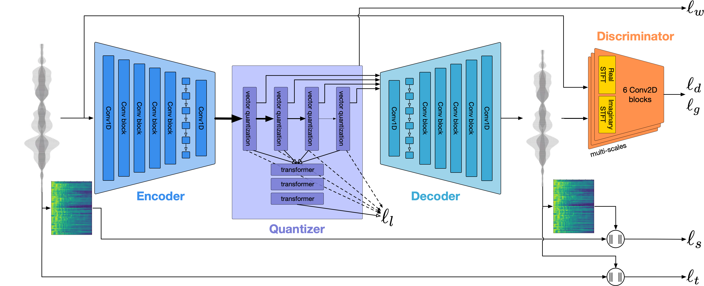
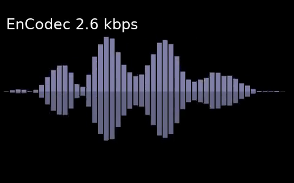

# EnCodec: High Fidelity Neural Audio Compression


This is the code for the EnCodec neural codec presented in the [High Fidelity Neural Audio Compression](https://arxiv.org/pdf/2210.13438.pdf) [[abs]](https://arxiv.org/abs/2210.13438).
paper. We provide our two multi-bandwidth models:
* A causal model operating at 24 kHz on monophonic audio trained on a variety of audio data.
* A non-causal model operating at 48 kHz on stereophonic audio trained on music-only data.

The 24 kHz model can compress to 1.5, 3, 6, 12 or 24 kbps, while the 48 kHz model
support 3, 6, 12 and 24 kbps. We also provide a pre-trained language model for each
of the models, that can further compress the representation by up to 40% without
any further loss of quality.

For reference, we also provide the code for our novel [MS-STFT discriminator](encodec/msstftd.py) and the [balancer](encodec/balancer.py).

<p align="center">
</p>


## Samples

Samples including baselines are provided on [our sample page](https://ai.honu.io/papers/encodec/samples.html).
You can also have a quick demo of what we achieve for 48 kHz music with EnCodec, along with
entropy coding, by clicking the thumbnail (original tracks provided by [Lucille Crew](https://open.spotify.com/artist/5eLv7rNfrf3IjMnK311ByP?si=X_zD9ackRRGjFP5Y6Q7Zng) and [Voyageur I](https://open.spotify.com/artist/21HymveeIhDcM4KDKeNLz0?si=4zXF8VpeQpeKR9QUIuck9Q)).

<p align="center">
<a href="https://ai.honu.io/papers/encodec/final.mp4">
</a></p>

## 🤗 Transformers

Encodec has now been added to Transformers. For more information, please refer to [Transformers' Encodec docs](https://huggingface.co/docs/transformers/main/en/model_doc/encodec).

You can find both the [24KHz](https://huggingface.co/facebook/encodec_24khz) and [48KHz](https://huggingface.co/facebook/encodec_48khz) checkpoints on the 🤗 Hub.

Using 🤗 Transformers, you can leverage Encodec at scale along with all the other supported models and datasets. ⚡️
Alternatively you can also directly use the encodec package, as detailed in the Usage section. 

To use first you'd need to set up your development environment!
```
pip install -U datasets 
pip install git+https://github.com/huggingface/transformers.git@main
```

Then, start embedding your audio datasets at scale!
```python
from datasets import load_dataset, Audio
from transformers import EncodecModel, AutoProcessor

# dummy dataset, however you can swap this with an dataset on the 🤗 hub or bring your own
librispeech_dummy = load_dataset("hf-internal-testing/librispeech_asr_dummy", "clean", split="validation")

# load the model + processor (for pre-processing the audio)
model = EncodecModel.from_pretrained("facebook/encodec_24khz")
processor = AutoProcessor.from_pretrained("facebook/encodec_24khz")

# cast the audio data to the correct sampling rate for the model
librispeech_dummy = librispeech_dummy.cast_column("audio", Audio(sampling_rate=processor.sampling_rate))
audio_sample = librispeech_dummy[0]["audio"]["array"]

# pre-process the inputs
inputs = processor(raw_audio=audio_sample, sampling_rate=processor.sampling_rate, return_tensors="pt")

# explicitly encode then decode the audio inputs
encoder_outputs = model.encode(inputs["input_values"], inputs["padding_mask"])
audio_values = model.decode(encoder_outputs.audio_codes, encoder_outputs.audio_scales, inputs["padding_mask"])[0]

# or the equivalent with a forward pass
audio_values = model(inputs["input_values"], inputs["padding_mask"]).audio_values

# you can also extract the discrete codebook representation for LM tasks
# output: concatenated tensor of all the representations
audio_codes = model(inputs["input_values"], inputs["padding_mask"]).audio_codes

```

## What's up?

See [the changelog](CHANGELOG.md) for details on releases.

## Installation

EnCodec requires Python 3.8, and a reasonably recent version of PyTorch (1.11.0 ideally).
To install EnCodec, you can run from this repository:
```bash
pip install -U encodec  # stable release
pip install -U git+https://git@github.com/facebookresearch/encodec#egg=encodec  # bleeding edge
# of if you cloned the repo locally
pip install .
```

**Supported platforms:** we officially support only Mac OS X (you might need XCode installed if running on a non Intel Mac), and recent versions of mainstream Linux distributions. We will try to help out on Windows but cannot provide strong support. Any other platform (iOS / Android / onboard ARM) are not supported.

## Usage

You can then use the EnCodec command, either as
```bash
python3 -m encodec [...]
# or
encodec [...]
```

If you want to directly use the compression API, checkout `encodec.compress`
and `encodec.model`. See hereafter for instructions on how to extract the discrete
representation.

### Model storage

The models will be automatically downloaded on first use using Torch Hub.
For more information on where those models are stored, or how to customize
the storage location, [checkout their documentation.](https://pytorch.org/docs/stable/hub.html#where-are-my-downloaded-models-saved)

### Compression

```bash
encodec [-b TARGET_BANDWIDTH] [-f] [--hq] [--lm] INPUT_FILE [OUTPUT_FILE]
```
Given any audio file supported by torchaudio on your platform, compresses
it with EnCodec to the target bandwidth (default is 6 kbps, can be either 1.5, 3, 6, 12 or 24).
OUTPUT_FILE must end in `.ecdc`. If not provided it will be the same as `INPUT_FILE`,
replacing the extension with `.ecdc`.
In order to use the model operating at 48 kHz on stereophonic audio, use the `--hq` flag.
The `-f` flag is used to force overwrite an existing output file.
Use the `--lm` flag to use the pretrained language model with entropy coding (expect it to
be much slower).

If the sample rate or number of channels of the input doesn't match that of the model,
the command will automatically resample / reduce channels as needed.

### Decompression
```bash
encodec [-f] [-r] ENCODEC_FILE [OUTPUT_WAV_FILE]
```
Given a `.ecdc` file previously generated, this will decode it to the given output wav file.
If not provided, the output will default to the input with the `.wav` extension.
Use the `-f` file to force overwrite the output file (be carefull if compress then decompress,
not to overwrite your original file !). Use the `-r` flag if you experience clipping, this will
rescale the output file to avoid it.

### Compression + Decompression
```bash
encodec [-r] [-b TARGET_BANDWIDTH] [-f] [--hq] [--lm] INPUT_FILE OUTPUT_WAV_FILE
```
When `OUTPUT_WAV_FILE` has the `.wav` extension (as opposed to `.ecdc`), the `encodec`
command will instead compress and immediately decompress without storing the intermediate
`.ecdc` file.

### Extracting discrete representations

The EnCodec model can also be used to extract discrete representations from the audio waveform.

```python
from encodec import EncodecModel
from encodec.utils import convert_audio

import torchaudio
import torch

# Instantiate a pretrained EnCodec model
model = EncodecModel.encodec_model_24khz()
# The number of codebooks used will be determined bythe bandwidth selected.
# E.g. for a bandwidth of 6kbps, `n_q = 8` codebooks are used.
# Supported bandwidths are 1.5kbps (n_q = 2), 3 kbps (n_q = 4), 6 kbps (n_q = 8) and 12 kbps (n_q =16) and 24kbps (n_q=32).
# For the 48 kHz model, only 3, 6, 12, and 24 kbps are supported. The number
# of codebooks for each is half that of the 24 kHz model as the frame rate is twice as much.
model.set_target_bandwidth(6.0)

# Load and pre-process the audio waveform
wav, sr = torchaudio.load("<PATH_TO_AUDIO_FILE>")
wav = convert_audio(wav, sr, model.sample_rate, model.channels)
wav = wav.unsqueeze(0)

# Extract discrete codes from EnCodec
with torch.no_grad():
    encoded_frames = model.encode(wav)
codes = torch.cat([encoded[0] for encoded in encoded_frames], dim=-1)  # [B, n_q, T]
```

Note that the 48 kHz model processes the audio by chunks of 1 seconds, with an overlap of 1%,
and renormalizes the audio to have unit scale. For this model, the output of `model.encode(wav)`
would a list (for each frame of 1 second) of a tuple `(codes, scale)` with `scale` a scalar tensor.

## Installation for development

This will install the dependencies and a `encodec` in developer mode (changes to the files
will directly reflect), along with the dependencies to run unit tests.
```
pip install -e '.[dev]'
```

### Test

You can run the unit tests with
```
make tests
```

## FAQ

Please check this section before opening an issue.

### Out of memory errors with long files

We do not try to be smart about long files, and we apply the model at once on the entire file. This can lead to a large memory usage
and result in the process being killed. At the moment we will not support this use case.

### Bad interactions between DistributedDataParallel and the RVQ code

We do not use DDP, instead we recommend using the routines in `encodec/distrib.py`, in particular `encodec.distrib.sync_buffer` and `encodec.distrib.sync_grad`.

## Citation

If you use this code or results in your paper, please cite our work as:

```
@article{defossez2022highfi,
  title={High Fidelity Neural Audio Compression},
  author={Défossez, Alexandre and Copet, Jade and Synnaeve, Gabriel and Adi, Yossi},
  journal={arXiv preprint arXiv:2210.13438},
  year={2022}
}
```

## License

The code in this repository is released under the MIT license as found in the
[LICENSE](LICENSE) file.
